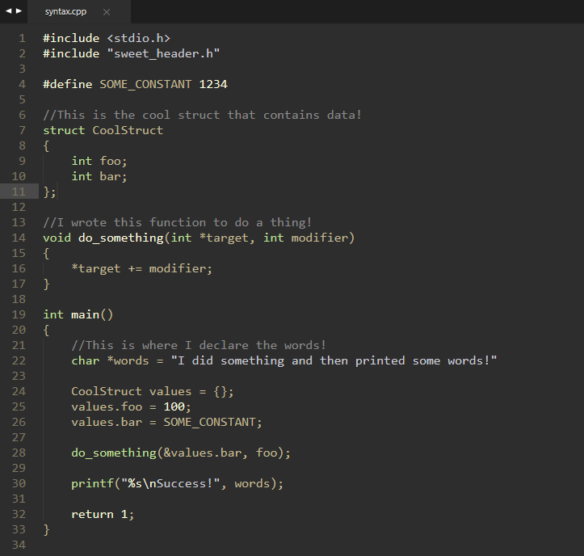

# Grun
This Sublime Text colour scheme was designed for less eye strain in dim light and to compliment the Afterglow Theme. 

If you'd like to tweak your theme to match:

| Tag                                  | Colour  |
|:-------------                        |:-------:|
| Background                           | #2D2D2D |
| Foreground, Caret                    | #BFB595 |
| Invisibles, LineHighlight, Selection | #4A4A4A |
| Keyword, Number, Constant, Fn Decl   | #FFFFDC |
| Storage Type, Function               | #BFE695 |
| String                               | #CDCDCD |
| Comment                              | #8A8A8A |
